# Novus

**A gamified financial-markets education platform.** You play a finance intern
in the city of Novus: walk the streets, take a desk at a bank, judge loan
files, spot warning signs in company accounts, trade a live market, and live
with the results. The teaching rides on the game. It never stops to lecture.

**▶ Play it: [game.akshatchowdhary.online](https://game.akshatchowdhary.online)**

> Single player, in the browser. Indian setting: rupees, UPI, a market
> regulator. Every company, borrower and market event you act on is
> **fictional**.

[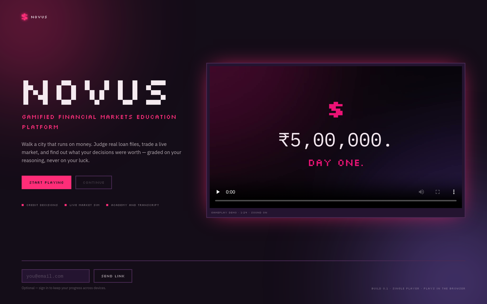](https://game.akshatchowdhary.online)

**Watch the 84-second trailer** on the [landing page](https://game.akshatchowdhary.online),
or open [`public/novus-demo.mp4`](public/novus-demo.mp4).

---

## Why it exists

Most people learn finance from textbooks, then make their first real money
decisions with no practice. Worse, they learn to judge a decision by how it
turned out, not by whether it made sense at the time.

Novus puts you inside a small working market, lets you make real decisions
under a clock, and *then* shows what each decision was worth and which idea it
turned on. Consequence first, vocabulary second.

### How it teaches (the rules it will not bend)

- **Reward the reasoning, not the dice.** Every call is graded against the
  file's hidden risk, never the outcome that happened to be rolled. A sound
  call that still defaulted is still sound; a lucky reckless one earns almost
  nothing.
- **Teaching arrives after an outcome,** pointing at numbers already on
  screen. No concept card ever pops up mid-decision.
- **Commit before the reveal.** You log a risk read before every result, so
  the brain does recall, not recognition.
- **The playable market stays fictional.** A real ticker in something you can
  buy turns a learning game into something that looks like advice. Real
  companies appear only as history: in the Casebook and the replays, with
  sources and a "not investment advice" line.
- **The optional AI wording layer never produces a number, a grade or a
  lesson.** Every path has written fallback text.

---

## What's in it

### The city

| | |
|---|---|
| **An open pixel city** | Walk it with WASD or the arrow keys (Phaser). Enterable venues include the Bank, the Exchange, Risk & Compliance, the Academy, the FinTech floor, the Payment Centre, the Cafeteria and your apartment. A day runs 9:15 am to 3:30 pm at one real second per game minute; the pressure is time. |
| **People with jobs for you** | A bank manager, a trader, a risk officer and a reporter. Each hands out quests, and their advice is confident and not always right. |
| **Progression** | XP, levels, and ten skills mapped to real competencies. Skills unlock analysis shortcuts in the decide view. |


### Decisions, graded on reasoning

| | |
|---|---|
| **Loan files** (the Bank) | Five credit files with real-shaped figures: revenue, cash flow, debt, collateral, a credit score. Read the risk, then approve, cut the amount, lend against collateral, or reject. |
| **Pattern files** (Risk & Compliance) | Company accounts referred by an auditor. Tick the lines that are genuine warning signs among decoys that only look odd, then clear it, query it, escalate it, or put it on a watchlist. Each one echoes a real collapse, which the game names afterwards: *"You have seen this before."* |
| **An allocation file** | A trust's book to rebalance, where the lesson is concentration. |
| **The verdict** | Every outcome shows two separate things: what happened, and whether your call was sound. The explanation is rebuilt from the file's own numbers. |

<p align="center">
  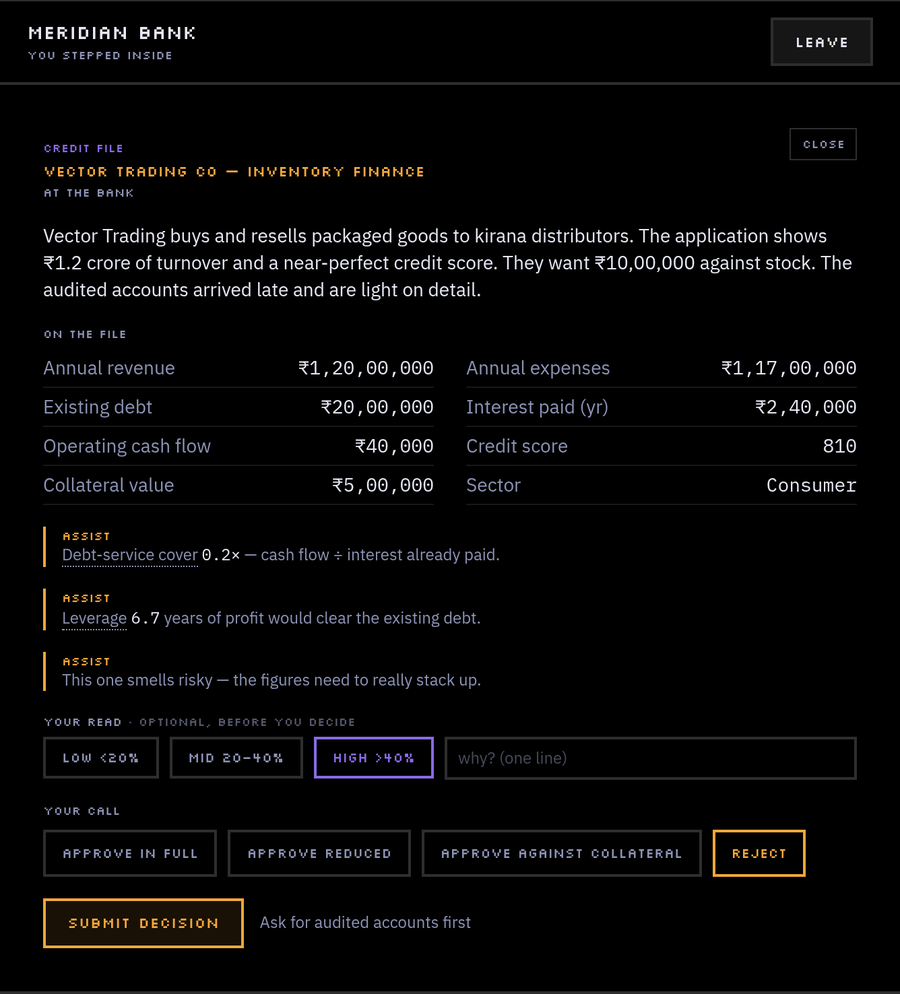
  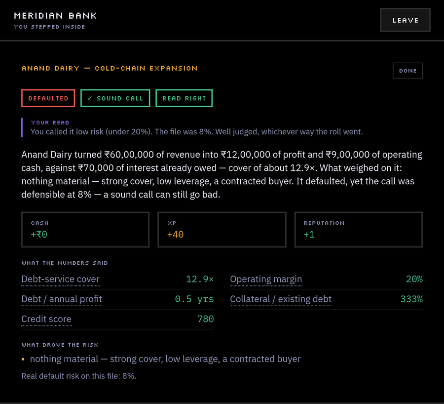
</p>

<p align="center">
  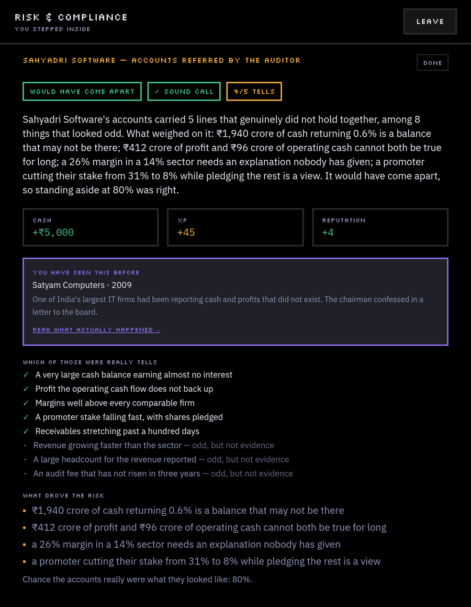
  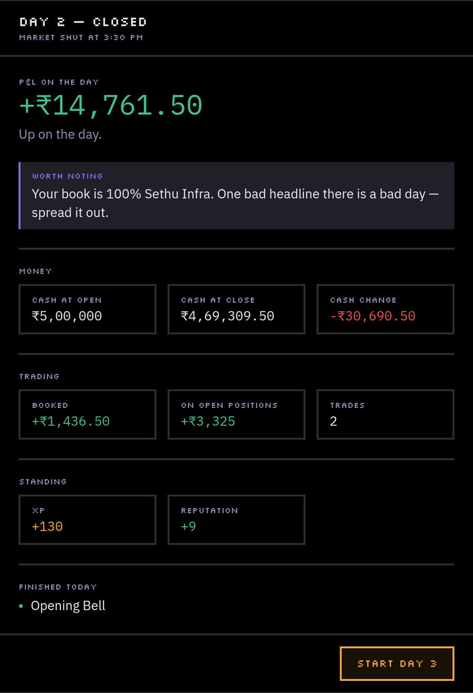
</p>

### A live market

| | |
|---|---|
| **Twelve invented companies** | Across real sectors, with P/E and D/E on the table. Prices move every second of play by drift, noise and sector shocks, seeded so a saved game carries on exactly as it would have. |
| **News, or noise?** | Every stock has a *Why did it move today?* breakdown that splits the day's move into drift, noise and news. Two stocks can rise the same amount for completely different reasons. |
| **Market events** | Most days carry a headline, such as a rate hike, infrastructure spending or a fraud, that shocks some sectors and leaves the rest to noise. |
| **Day-end report** | Profit and loss, what you booked, and one teaching sentence about the day. |

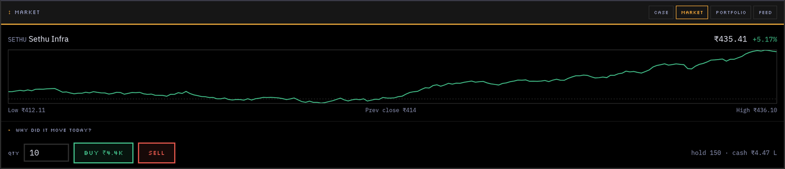
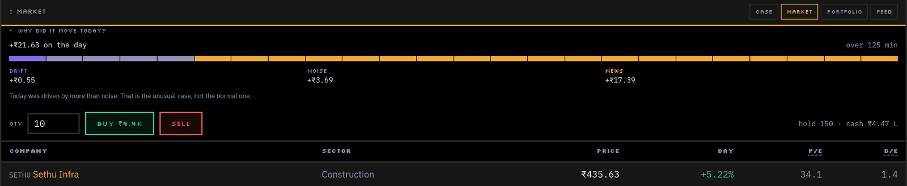

### The Academy

| | |
|---|---|
| **The Ledger** | Twelve concept cards (debt-service cover, cash vs revenue, leverage, P/E, diversification…) that unlock as you actually meet them, with a tap-to-explain tooltip on every ratio in the game. |
| **Modules** | Five mini-courses, each with a short check: 60% to pass, retakeable, and it blocks nothing. |
| **Drills** | Five self-contained exercises: the credit desk, build a book, spot the shock, and two **historical replays**, Satyam (2008) and IL&FS (2018). The replays show only what was public at each step, and you're marked on what was defensible then, not on knowing the ending. |
| **The Casebook** | Six real, concluded events as study material: Satyam, IL&FS, the PNB letters of undertaking, the 1992 securities scam, Kingfisher, and 2008. Each has a timeline, the numbers, what was visible beforehand, and sources. *(Draft content, pending a source pass.)* |
| **Mistakes** | Repeated habits (unsound calls, a concentrated book, trading the noise, missed warning signs) surface as a named pattern with its lesson. |

<p align="center">
  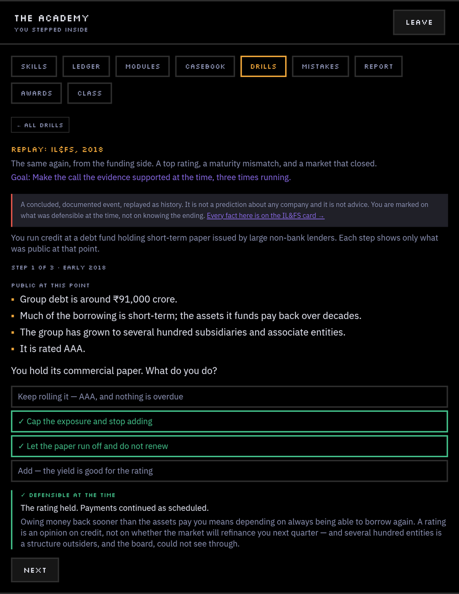
  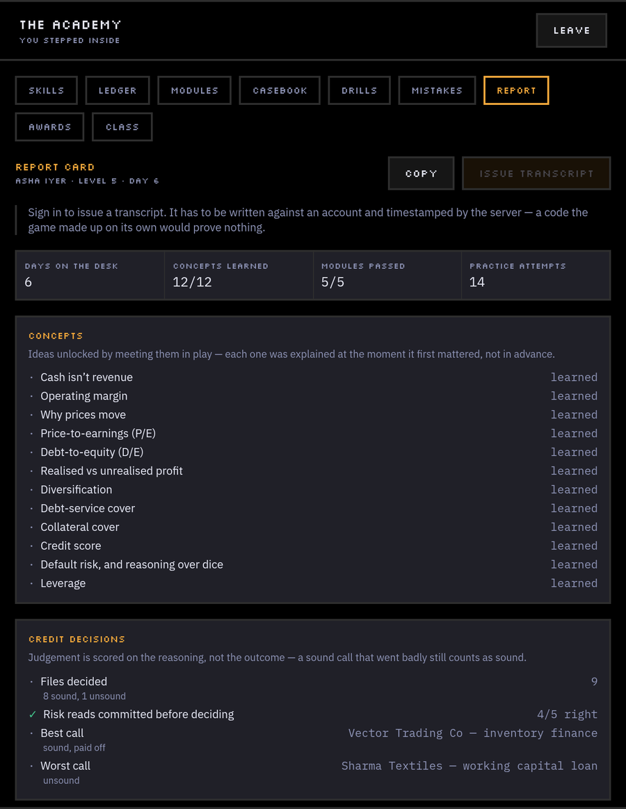
</p>

### Records anyone can check

| | |
|---|---|
| **Transcript** | Concepts learned, your decision record with risk-read accuracy, modules passed and practice attempts. Issue it and it gets a code like `NVS-7KQ2M-X4P9D`; anyone can open `/t/<code>` to verify it, no sign-in needed. |
| **Awards** | Named awards with published conditions, such as *Credit Analysis: Foundation* and *Market Conduct: Foundation*. Every requirement is measured, never granted. |
| **Attempt history** | Every drill and module attempt is logged, so progress shows first try against latest, not just a best score. |

<p align="center">
  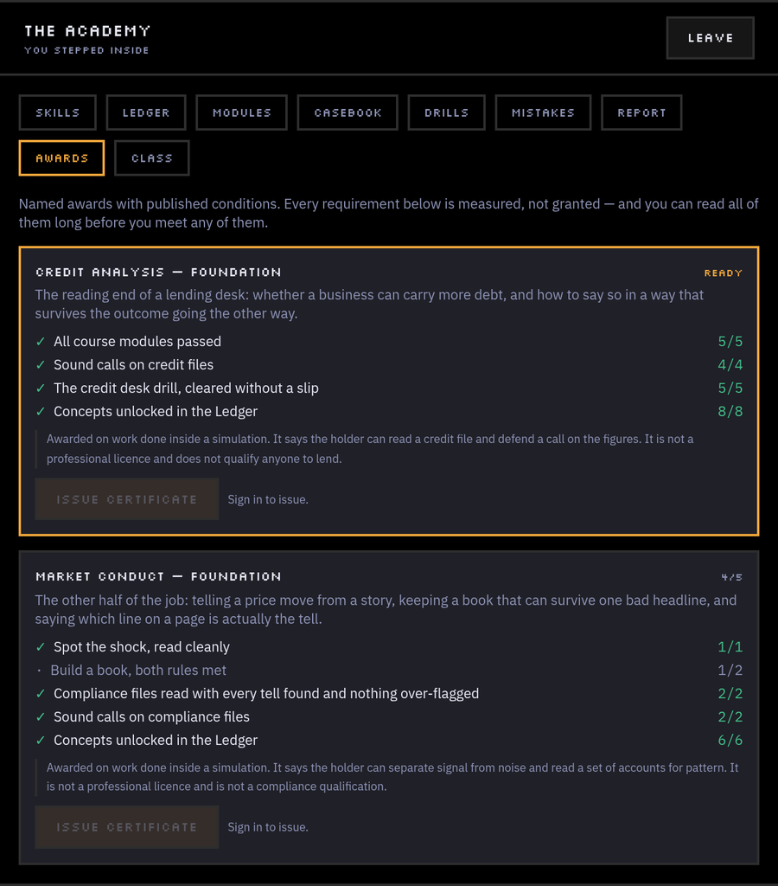
</p>

### For teachers

`/teach` is a separate, plain dashboard. Create a class, share its join code,
and set drills and modules with due dates. A class opens on one screen:

- who has passed, not yet passed, or not started each assignment
- a heatmap of the habits the game logged per student
- sound vs unsound decisions per student
- time played against concepts learned
- attempts per day
- **What to teach next:** the habits at least a quarter of the class share, such as *"Trading the noise, 7 of 12 students"*

Click a student anywhere and every chart follows them. Students choose what to
share, and their save, cash and transcripts stay private; that's enforced by
the database, not the page. **See it without signing in:
[/teach/sample](https://game.akshatchowdhary.online/teach/sample)**, an
invented class clearly marked as sample data.

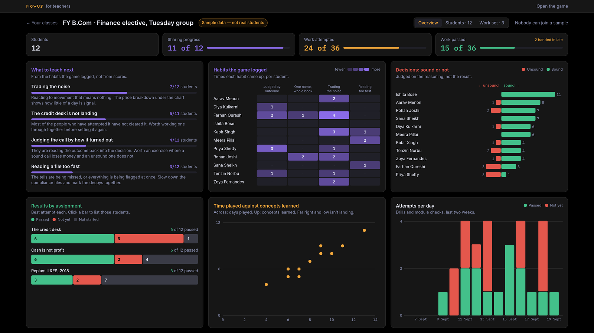

### Around it

- **Cloud save.** Optional magic-link sign-in (Supabase); otherwise the save
  lives in the browser.
- **Music and sound.** A background track that fades down whenever you're
  inside reading, plus interface cues. Each has its own switch.
- **Fullscreen on start,** with Esc kept for closing panels (hold Esc to
  leave fullscreen). It can be switched off.
- **Accessibility.** A colour-safe mode swaps green/red for blue/amber, and
  every gain or loss is signed anyway. Reduced motion is respected (OS setting
  and an in-game toggle).
- **AI wording.** Optional; rephrases case write-ups through any
  OpenAI-compatible endpoint, with written fallbacks that carry the game on
  their own.

---

## Play it

**Hosted:** [game.akshatchowdhary.online](https://game.akshatchowdhary.online)

**Local:**

```bash
npm install
npm run dev        # http://localhost:5173
```

Other scripts: `npm run build`, `npm run preview`, `npm run typecheck`.

Cloud save, transcripts, classes and AI wording are off unless you provide the
keys: copy `.env.example` to `.env` and fill in what you want, and run
[`docs/supabase.sql`](docs/supabase.sql) once on your Supabase project.
Nothing breaks without them.

---

## Built with

Vite · React 19 · TypeScript (strict) · Tailwind v4 · Phaser 4 · Zustand ·
Supabase (optional). Art is the [Kenney RPG Urban](https://kenney.nl/assets/rpg-urban-pack)
pack (CC0); music is "SummerTown" by LushoGames (CC0). Type: Silkscreen for
display, IBM Plex Sans / Mono for reading and numbers, Inter for the teacher
dashboard.

Money is stored as whole paise; figures are lakh and crore, formatted through
one helper, never by hand.

## Architecture

Three layers, kept strictly apart. This is what keeps the market testable and
leaves multiplayer possible later:

| Folder | May do | May never do |
|--------|--------|--------------|
| `sim/` | all rules, money, randomness | import React / Phaser / `fetch`; call `Math.random()` (seeded RNG only) |
| `world/` | draw the city, move the player | decide anything about money |
| `ui/` | show state, send actions | do money maths itself |

Everything meets at `state/store.ts`. Phaser touches the rest of the app only
through `world/bridge.ts`. Privacy between a teacher and a student is enforced
in Postgres row-level security, not in the client.

```
src/
  app/     screen switch and routes (/, /t/<code>, /teach)
  ui/      React: HUD, panels, cases, dialogue, the Academy, drills, the teacher dashboard
  world/   Phaser: the city, the player, the bridge
  sim/     rules and money maths: plain TypeScript, deterministic
  data/    content: stocks, cases, quests, NPCs, events, concepts, modules, casebook, replays
  state/   the store, saving, migrations, cloud, attempts, transcripts, classes
  ai/      the wording layer and its written fallbacks
  lib/     formatting, sound, music, fullscreen, the Supabase client
docs/      architecture, build steps, design tokens, the education spec, issues, the SQL schema
demo-kit/  everything used to record and cut the trailer
```

## Docs

- [`CLAUDE.md`](CLAUDE.md): read first if you're picking this up
- [`docs/architecture.md`](docs/architecture.md): how the layers fit and why
- [`docs/build-steps.md`](docs/build-steps.md): the ordered build log
- [`docs/design.md`](docs/design.md): palette, type, and the rules behind the look
- [`docs/education.md`](docs/education.md): the full spec for the education layer
- [`docs/issues.md`](docs/issues.md): what's done and what's next
- [`docs/supabase.sql`](docs/supabase.sql): the whole database schema, idempotent
- [`demo-kit/README.md`](demo-kit/README.md): how the trailer was recorded and cut

## Status

The build plan, the redesign pass, and the credibility and utility tracks
(A and B in `docs/issues.md`) are done and deployed. That covers honest
day-end numbers, colour-safe mode, verifiable transcripts, attempt history,
cases beyond loans, market explanations, historical replays, awards, and the
teacher side.

Next, from track C: onboarding, a mobile layout, a test suite, a longer arc
across weeks, and the three buildings that are still only nameplates. The
Casebook keeps its draft banner until its figures get a source pass. Not in
this build: multiplayer, extra careers, options and futures.

## Credits & disclaimer

Art © [Kenney](https://kenney.nl) (CC0). Music: "SummerTown" by
[LushoGames](https://opengameart.org/content/summertown) (CC0). Fonts via Google
Fonts (OFL).

Novus is an educational simulation. The playable market, the borrowers and the
events you act on are entirely fictional. The Casebook and the replays discuss
real past events as study material, with sources cited; nothing in this
project is investment advice.
