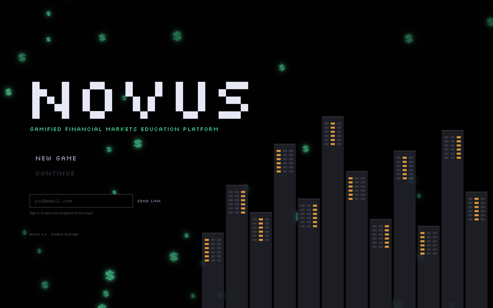
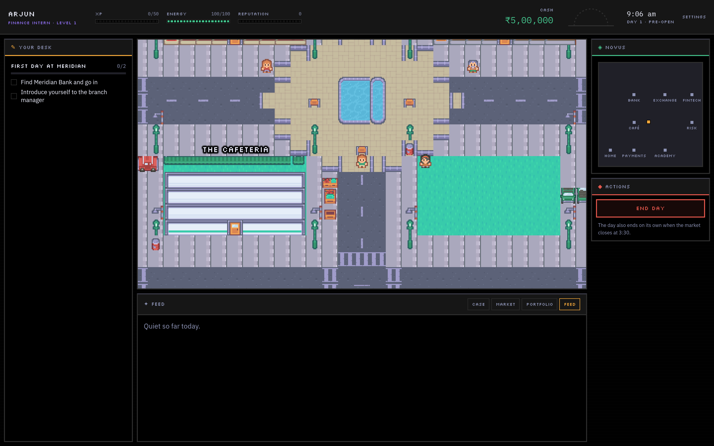
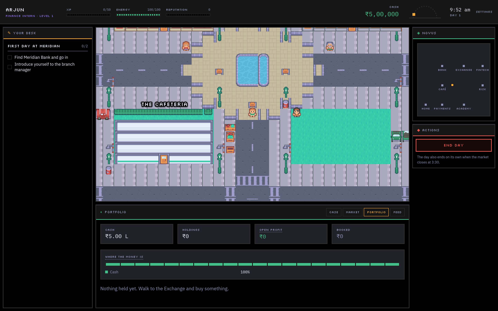
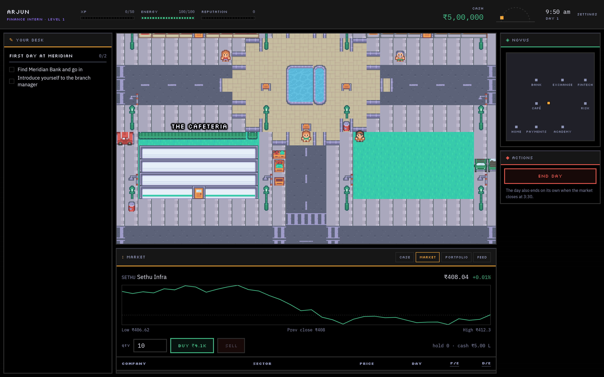
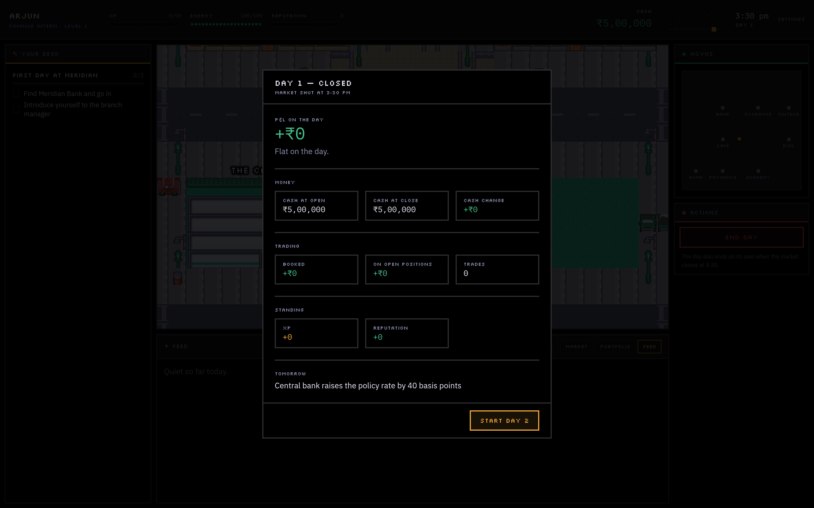

# Novus

**A gamified financial-markets education platform.** You play a finance intern
in the city of Novus: walk the streets, take a desk at a bank, judge loan
files, trade a simulated market, and live with the results. The teaching rides
on the game — it never stops to lecture.

**▶ Live demo: [game.akshatchowdhary.online](https://game.akshatchowdhary.online)**

> Single player. Indian setting — rupees, UPI, a market regulator. Every
> company, borrower, and market event in the playable game is **fictional**.



---

## Why it exists

Most "learn finance" products are a quiz with a progress bar. Novus takes the
opposite bet: put someone inside a small working market, let them make real
decisions under a clock, and *then* show them what a decision was worth and
which idea it turned on. Consequence first, vocabulary second.

It is built to be **used as a simulator and be assessed from** — there is a
running transcript of what you have learned, decided, predicted, and got wrong
— without turning into a spreadsheet with a mascot.

### How it teaches (the rules it will not bend)

- **Reward the reasoning, not the dice.** A loan call is graded against a
  hidden truth, never the sampled outcome. A sound call that still defaulted is
  still sound; a lucky reckless one earns almost nothing.
- **Teaching arrives after an outcome, pointing at numbers already on screen.**
  No concept card ever pops up mid-decision.
- **Commit before the reveal.** You log a risk read before every result, so the
  brain does recall, not recognition.
- **The playable simulation stays fictional.** A real ticker in something you
  can buy turns a learning game into what looks like advice. Real companies
  appear in exactly one place — the Casebook, as historical record of concluded
  events, with sources and a "not investment advice" line.
- **The optional AI wording layer never produces a number, a grade, or a
  lesson.** Every path has written fallback text.

---

## What's in it

### The game

| | |
|---|---|
| **An open pixel city** | Walk it with arrow keys / WASD (Phaser). Eight enterable venues — Bank, Exchange, FinTech floor, Academy, Risk & Compliance, Payment Centre, Cafeteria, your apartment — plus scenery. A day runs 9:15 am → 3:30 pm at one real second per game minute; the pressure is time. |
| **A simulated market** | Twelve invented listed companies across real sectors. Prices move every minute by drift + noise + sector shocks, seeded so a saved game resumes bit-for-bit. Intraday chart, P/E and D/E on the table, buy/sell with specific rejections, no brokerage. |
| **Credit-decision cases** | Loan files with real figures — cash flow, collateral, leverage, a credit score. You make the call; it is scored on your reasoning. Afterwards the ratios are rebuilt and explained. |
| **Biased advisors** | NPCs give advice that is confident and often wrong. Trust is something you work out by watching it play out. |
| **Progression** | XP, levels, ten skills mapped to real competencies. Skill thresholds unlock analysis shortcuts in the decide view. |
| **Events** | Most days carry a market event — a rate hike, infrastructure news, a fraud headline — that shocks some sectors and leaves the rest to noise. |

<p align="center">
  
  
</p>

### The education layer

| | |
|---|---|
| **The Ledger** | Twelve concept cards (debt-service cover, cash vs revenue, leverage, P/E, diversification, drift/noise/shock…) that unlock as you actually meet them. Tap-to-explain tooltips on every ratio in the game. Wikipedia further-reading links. |
| **Predict, then reveal** | An optional "your read" on every case — low / mid / high plus a one-line why — graded against the truth, echoed back on the outcome screen. Skipping it costs the feedback, never the decision. |
| **Assist toggle** | Show the case ratios up front, or turn it off and work them out (or unlock them with skills). |
| **Day-end debrief + mistake log** | One teaching sentence about the day. Repeated mistakes (unsound calls, a concentrated book, churn) surface as a named pattern. |
| **Academy modules** | Five mini-courses — reading a loan file, balance-sheet stress, cash vs profit, don't bet the book, reading the tape — each with a short check. 60% to pass, retakeable, blocks nothing. |
| **The Casebook** | Six real concluded events — Satyam (2009), IL&FS (2018), the PNB letters of undertaking (2018), the 1992 securities scam, Kingfisher (2012), the 2008 crisis — as study material: timeline, the numbers, what was visible beforehand, the fictional case it rhymes with, sources. *(Draft content — figures pending a source pass.)* |
| **Scenario drills** | Three self-contained exercises with no city, clock, or save: the credit desk (five files back to back), build a book (an allocation exercise), spot the shock (pick who a headline lifts). |
| **Transcript** | Concepts learned, your credit-decision record with risk-read accuracy, best and worst call, modules passed, mistakes logged — with a plain-text copy button. |

<p align="center">
  
  
</p>

### Around it

- **Cloud save** — optional Supabase magic-link sign-in; otherwise the save
  lives in the browser.
- **AI wording** — optional; rephrases the case write-ups through any
  OpenAI-compatible endpoint, with written fallbacks that carry the game on
  their own.
- **Accessibility** — reduced motion is respected globally (OS setting and an
  in-game toggle); sound is a synth layer with a toggle, no asset files.

---

## Play it

**Hosted:** [game.akshatchowdhary.online](https://game.akshatchowdhary.online)

**Local:**

```bash
npm install
npm run dev        # http://localhost:5173
```

Other scripts: `npm run build`, `npm run preview`, `npm run typecheck`.

Cloud save and AI wording are off unless you provide the keys — copy
`.env.example` to `.env` and fill in what you want. Nothing breaks without them.

---

## Built with

Vite · React 19 · TypeScript (strict) · Tailwind v4 · Phaser 4 · Zustand ·
Supabase (optional). Art is the [Kenney RPG Urban](https://kenney.nl/assets/rpg-urban-pack)
pack (CC0). Type: Silkscreen for display, IBM Plex Sans / Mono for reading and
numbers.

Money is stored as whole paise; figures are lakh and crore, formatted through
one helper, never by hand.

## Architecture

Three layers, kept strictly apart — this is what keeps the market testable and
leaves multiplayer possible later:

| Folder | May do | May never do |
|--------|--------|--------------|
| `sim/` | all rules, money, randomness | import React / Phaser / `fetch`; call `Math.random()` (seeded RNG only) |
| `world/` | draw the city, move the player | decide anything about money |
| `ui/` | show state, send actions | do money maths itself |

Everything meets at `state/store.ts`. Phaser touches the rest of the app only
through `world/bridge.ts`.

```
src/
  app/     screen switch
  ui/      React: HUD, panels, cases, dialogue, the Academy, drills
  world/   Phaser: the city, the player, the bridge
  sim/     rules and money maths — plain TypeScript, deterministic
  data/    content: stocks, cases, quests, NPCs, events, concepts, modules, casebook
  state/   the store, saving, migrations, new-game
  ai/      the wording layer and its written fallbacks
  lib/     formatting, sound, the Supabase client
docs/      architecture, build steps, design tokens, the education spec
```

## Docs

- [`CLAUDE.md`](CLAUDE.md) — read first if you are picking this up
- [`docs/architecture.md`](docs/architecture.md) — how the layers fit and why
- [`docs/build-steps.md`](docs/build-steps.md) — the ordered build log (16 steps + a redesign pass)
- [`docs/design.md`](docs/design.md) — palette, type, and the rules behind the look
- [`docs/education.md`](docs/education.md) — the full spec for the education layer

## Status

The 16-step build and the redesign pass (city, panels, education layer) are
done and deployed. Deferred: generalising `FinancialCase` beyond loan files,
the three unbuilt interiors, and a source pass on the Casebook before its
content is treated as final. Not in this build: multiplayer, extra careers, a
company-management sim, options and futures, a mobile layout.

## Credits & disclaimer

Art © [Kenney](https://kenney.nl) (CC0). Fonts via Google Fonts (OFL).

Novus is an educational simulation. The playable market, the borrowers, and the
events you act on are entirely fictional. The Casebook discusses real past
events as study material with sources cited; nothing in this project is
investment advice.
